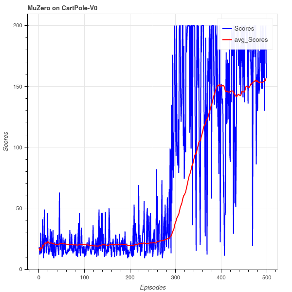

# MuZero - Cartpole
 Implementation of MuZero in Pytorch on OpenAI's gym CartPole environment.

Training on Cartpole-v0 
--------------------------
To train a model, run the main function: ``python muzero.py``.

Results
--------------------------
**DISCLAIMER**: this code is early research code. 
- Takes about 350 episodes to consitantly achieve a score of 500 on Cartpole-V1.
- Takes about 400 episodes to consitantly achieve a score of 200 on Cartpole-V0

 

Credits 
--------------------------
- https://arxiv.org/src/1911.08265v1/anc/pseudocode.py
- https://github.com/Hauf3n/MuZero-PyTorch
- https://github.com/chiamp/muzero-cartpole\
- https://github.com/geohot/ai-notebooks/tree/master/muzero

 
